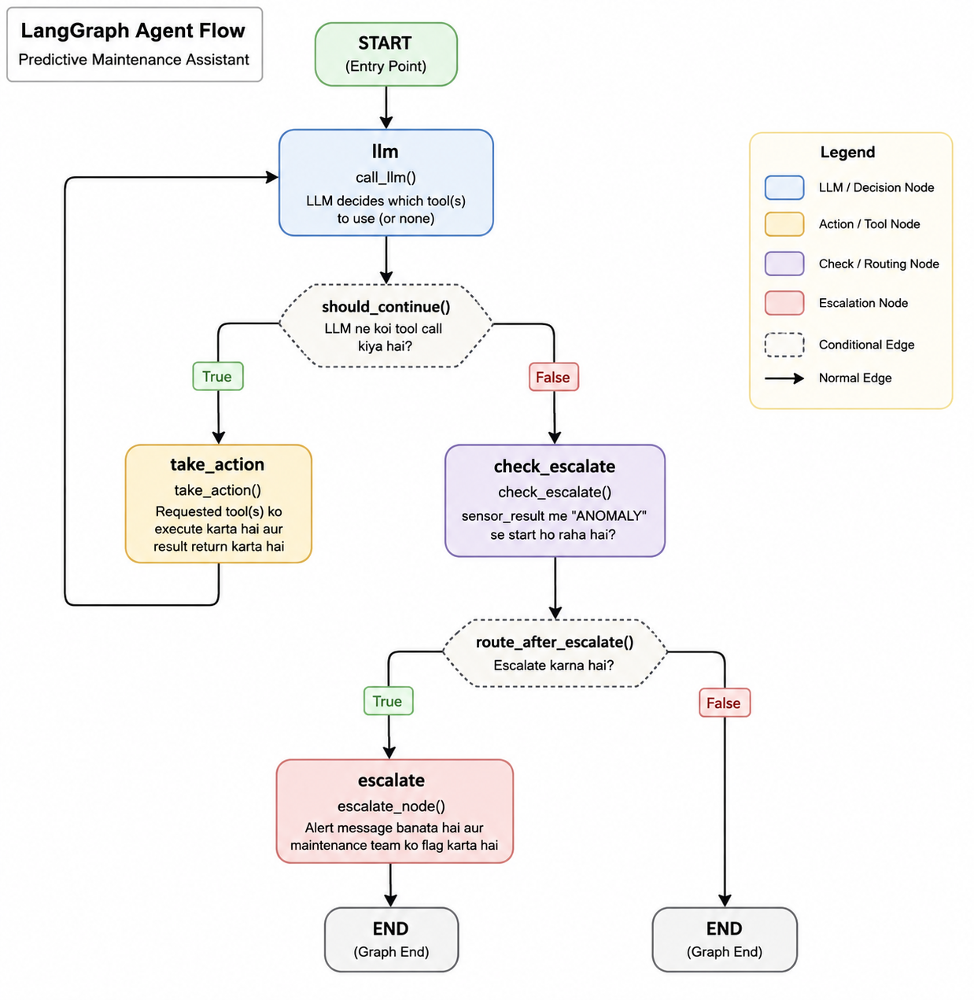

# ForgeIQ: Agentic RAG for Predictive Maintenance


ForgeIQ is a local-first Agentic RAG application for investigating industrial machine issues. It combines semantic maintenance-log retrieval, deterministic sensor checks, failure-threshold lookup, and LangGraph conversation memory in one workflow.

The included web interface provides an almond-and-orange operations console with chat, per-turn tool traces, fleet status, machine history, and anomaly escalation.


## Interface Preview




## Features

- Agentic tool selection with LangGraph and `llama3.2` through Ollama.
- Semantic retrieval over maintenance records with Chroma and `nomic-embed-text`.
- Deterministic checks for live sensor readings, machine IDs, and failure thresholds.
- Fleet dashboard for 20 machines with sensor status and maintenance history.
- Conversation memory keyed by browser session and LangGraph `thread_id`.
- Per-turn tool traces, escalation cards, and typewriter-style answer rendering.
- REST API for chat, fleet catalog, machine status, and maintenance history.

## Architecture

```text
Vite + React frontend (frontend/)
        |
        | HTTP: /chat, /machines, /machines/{id}/status, /machines/{id}/history
        v
FastAPI adapter (app.py)
        |
        v
LangGraph agent (graph.py, nodes.py, state.py)
        |
        +-- Chroma retrieval: maintenance logs
        +-- Pandas sensor checks: sensor_data.csv
        +-- Threshold lookup: tools.py
        +-- LangGraph MemorySaver: conversation context
```

The graph routes tool calls through `take_action`, checks current sensor output for anomalies, and emits an escalation when inspection is required.

## Repository Layout

```text
manufacturing-rag-agent/
├── app.py                    # FastAPI adapter used by the frontend
├── main.py                   # CLI entry point
├── graph.py                  # LangGraph workflow and MemorySaver
├── nodes.py                  # LLM, tool execution, and escalation nodes
├── state.py                  # Agent state schema
├── tools.py                  # Retriever, sensors, thresholds, machine catalog
├── ingest.py                 # Builds the Chroma vector store
├── evaluate.py               # Optional RAGAS evaluation script
├── requirements.txt          # Runtime Python dependencies
├── requirements-eval.txt     # Optional evaluation dependencies
├── data/
│   ├── maintenance_logs.csv
│   └── sensor_data.csv
├── frontend/                 # React + Vite application
│   ├── src/
│   ├── package.json
│   └── .env.example
├── docs/images/
│   ├── agent-graph.png
│   └── Screenshot 2026-08-31 220612.png
└── tests/
    └── test_api.py
```

Generated folders such as `venv/`, `chroma_store/`, `frontend/node_modules/`, `frontend/dist/`, and `.vite/` are ignored by Git.

## Prerequisites

- Python 3.10 or later
- Node.js 20 or later
- Ollama installed and running locally

Pull the local models once:

```bash
ollama pull llama3.2
ollama pull nomic-embed-text
```

## Run Locally

### 1. Prepare the Python environment

```bash
cd /f/portfolio-projects/RAG/manufacturing-rag-agent
python -m venv venv
./venv/Scripts/python.exe -m pip install -r requirements.txt
```

Build the vector store whenever `data/maintenance_logs.csv` changes:

```bash
./venv/Scripts/python.exe ingest.py
```

### 2. Start the API

Open a terminal in the project root:

```bash
./venv/Scripts/python.exe -m uvicorn app:app --host 127.0.0.1 --port 8010
```

API documentation is available at `http://127.0.0.1:8010/docs`.

### 3. Start the frontend

Open a second terminal:

```bash
cd /f/portfolio-projects/RAG/manufacturing-rag-agent/frontend
cp .env.example .env
npm ci
npm run dev -- --host 127.0.0.1 --port 5173
```

Open `http://127.0.0.1:5173`.

`VITE_API_URL` defaults to `http://127.0.0.1:8010`; set it in `frontend/.env` when the API uses another host or port.

## CLI Usage

The original terminal interface remains available:

```bash
./venv/Scripts/python.exe main.py
```

Example questions:

- `How many machines are there and what are their names?`
- `What is the current sensor status of M07?`
- `Summarize the maintenance history for M03.`
- `Which machines are currently anomalous?`
- `What are the failure thresholds?`

## API

| Method | Endpoint | Description |
| --- | --- | --- |
| `GET` | `/health` | API health check |
| `POST` | `/chat` | Runs the Agentic RAG workflow for a message and thread ID |
| `GET` | `/machines` | Returns all machine IDs |
| `GET` | `/machines/{machine_id}/status` | Compares current sensor readings to thresholds |
| `GET` | `/machines/{machine_id}/history` | Returns maintenance-log entries for a machine |

Example request:

```bash
curl -X POST http://127.0.0.1:8010/chat \
  -H "Content-Type: application/json" \
  -d '{"message":"What is the status of M07?","thread_id":"demo-session"}'
```

## Testing and Evaluation

Run deterministic API smoke tests:

```bash
./venv/Scripts/python.exe -m unittest discover -s tests -v
```

Run the optional RAGAS evaluation after installing its dependencies:

```bash
./venv/Scripts/python.exe -m pip install -r requirements-eval.txt
./venv/Scripts/python.exe evaluate.py
```

RAGAS uses the same local Ollama models and can take time on CPU-only machines.

